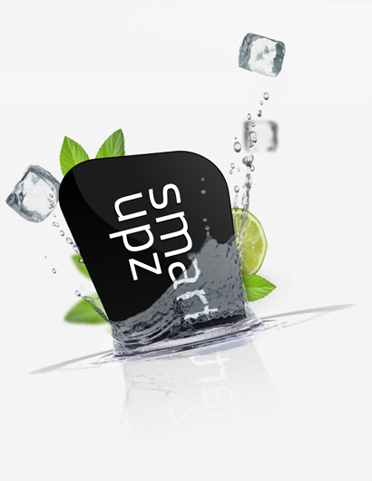

# O mnie

### 2004-2009:

Student Kolegium MISMAP na UW (Informatyka, Matematyka i trochę Fizyki)

### Około 2008/2009

Zacząłem pracować razem z Marekiem Stępniowskim nad projektem
[**Wolnelektury.pl**](http://www.wolnelektury.pl/).

### Marzec 2010

Dołączyłem do zespołu [**Smartupz.com**](http://www.smartupz.com/).

### Sierpień 2010 

Mój pierszy patch przyjęty do Django. Yey! (nic wielkiego, ale zawsze :P)

### Aktualnie

Nadal w Smartupz i nadal pracuję w Django.

[Porozmawiaj ze mną o integracji z Babel :)]

----

 {@align=center}

